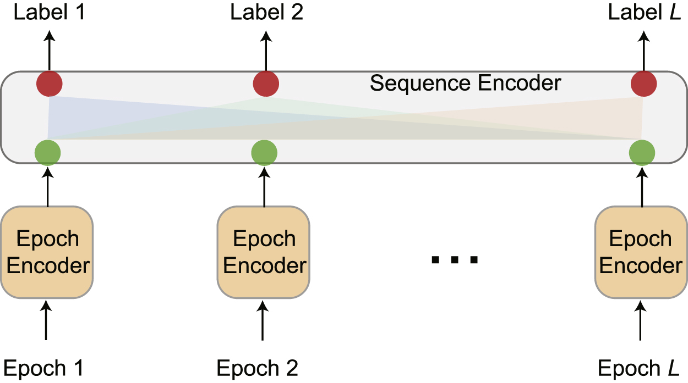

# PhysioEX: a PyTorch Lightning-Based Library for Interpreting Deep Learning Models in the Analysis of Physiological Signals."

PhysioEx ( Physiological Signal Explainer ) is a versatile PyTorch Lightning library tailored for building, training, and explaining deep learning models for physiological signal analysis. 

## Supported Models and Architectures

PhysioEx currently support the [Sequence-to-Sequence](https://iopscience.iop.org/article/10.1088/1361-6579/ac6049/meta)(SS) models framework. 

SS models take as input a sequence of L input sleep epochs and process them using two Encoders, an epoch Encoder and a sequence encoder. The epoch encoder acts as an epoch-wise feature extractor which transforms an input epoch in the input sequence into an epoch-feature vector for
representation. As a result, the input sequence is transformed into a sequence of feature vectors. Then the epochs sequence is processed using a sequence encoder which takes as input L-feature vectors and produce as output L-features vectors using a RNN aproach to represent intra-sequences information. Then the models provide as output L classes.

[](https://iopscience.iop.org/article/10.1088/1361-6579/ac6049/meta)

The supported models in the SS framework are:
- [Chambon2018](https://ieeexplore.ieee.org/document/8307462)
- [TinySleepNet](https://github.com/akaraspt/tinysleepnet)

## Supported Datasets

- [SleepEDF (version 2018-2013)](https://physionet.org/physiobank/database/sleep-edfx/sleep-cassette/)
- [Dreem (version DODO-DODH)](https://github.com/Dreem-Organization/dreem-learning-open)

To train and save one of the supported models on one of the supported you can use the `train` command

To use the `train` command, follow these steps:

1. **Clone the Repository:**
```bash
   git clone https://github.com/your-username/physioex.git
   cd physioex
```
2. **Create a Virtual Environment (Optional but Recommended)**
```bash
    conda create -n physioex python==3.10
    conda activate physioex
    conda install pip
    pip install --upgrade pip  # On Windows, use `venv\Scripts\activate`
```
3. **Install Dependencies and Package in Development Mode**
```bash
    pip install -e .
```

Now that you have installed the repository, you can use the `train` command to initiate training. The command has various options that you can customize based on your needs.

```bash
    train --experiment <experiment_name> --dataset <dataset_name> --version <version> etc
```

## Model Interpretability

Understanding the decisions made by your physiological signals classifier is crucial for both research and application purposes. 

PhysioEx leverages the Captum library to provide interpretability, allowing you to explore and interpret the model's decisions in a transparent manner. Captum offers a suite of techniques for feature attribution, helping you uncover the significance of different input features in the classification process.

TODO: example for extract the explanations

## Contributing

We welcome contributions from the community to enhance and expand InterSleep. If you're interested in contributing, please follow these steps:

1. Fork the repository.
2. Create a new branch for your feature or bug fix.
3. Make your changes and ensure tests pass.
4. Submit a pull request.
