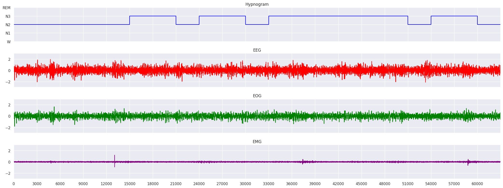

# Data Module 

The `physioex.data` module provides the API to read the data from the disk once the raw datasets have been processed by the `Preprocess` module. It consists of two classes: 
- `physioex.data.PhysioExDataset` which serialize the disk processed version of the dataset into a `PyTorch Dataset`
- `physioex.data.PhysioExDataModule` which transforms the datasets to `PyTorch DataLoaders` ready for training. 

### Example of Usage

The `PhysioExDataset` class is automatically handled by the `PhysioExDataModule` class when you need to use it for training or testing purposes. In most of the cases you don't need to interact with the `PhysioExDataset` class.

The class is instead really helpfull when you need to visualize your data, or you need to get some samples of your data to provide them as input to Explainable AI algorithms.

In these cases you need to instantiate a `PhysioExDataset`:

```python
from physioex.data import PhysioExDataset

data = PhysioExDataset(
    datasets = ["hmc"], # you can read different datasets merged together in this way
    preprocessing = "raw",  
    selected_channels = ["EEG", "EOG", "EMG"],     
    data_folder = "/your/data/path/",
)

# you can now access any sequence of epochs in the dataset
signal, label = data[0]

signal.shape # will be [21 (default sequence lenght), 3, 3000]
label.shape # will be [21]
```

```python
import seaborn as sns
import numpy as np 

hypnogram = np.ones((21, 3000)) * label.numpy().reshape(-1, 1)

# plot a subfigure with one column for each element of the sequence (21)
fig, ax = plt.subplots(4, 1, figsize = (21, 8), sharex="col", sharey="row")

hypnogram = hypnogram.reshape( -1 )
signals = signal.numpy().transpose(1, 0, 2).reshape(3, -1)

# set tytle for each subplot
sns.lineplot( x = range(3000*21), y = hypnogram, ax = ax[0], color = "blue")
# then the channels:
sns.lineplot( x = range(3000*21), y = signals[ 0], ax = ax[1], color = "red")
sns.lineplot( x = range(3000*21), y = signals[ 1], ax = ax[2], color = "green")
sns.lineplot( x = range(3000*21), y = signals[ 2], ax = ax[3], color = "purple")    

# check the examples notebook "visualize_data.ipynb" to see how to customize the plot properly

plt.tight_layout()
```



## Documentation

::: physioex.data.dataset.PhysioExDataset
    handler: python
    options:
      members:
        - __init__
        - __getitem__
        - __len__
        - split
        - get_num_folds
        - get_sets
      show_root_heading: false
      show_source: false