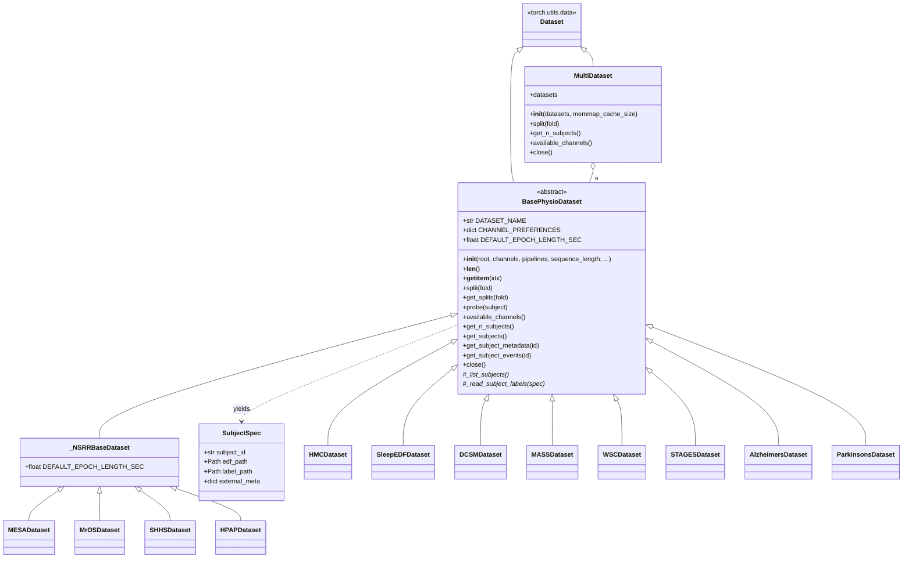
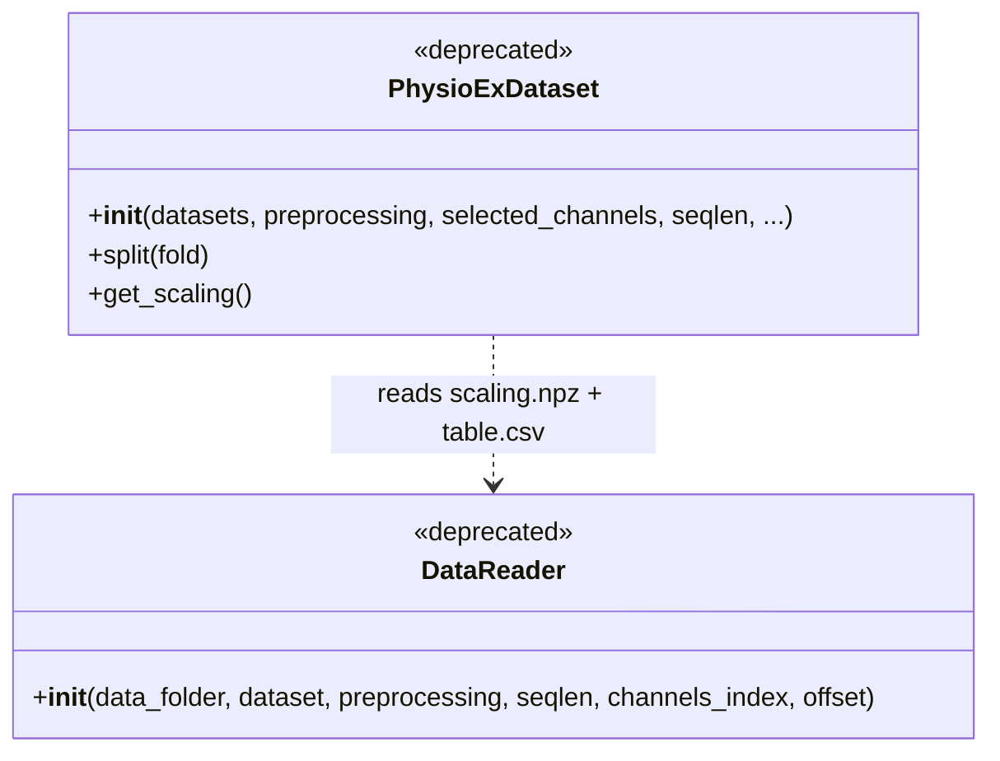
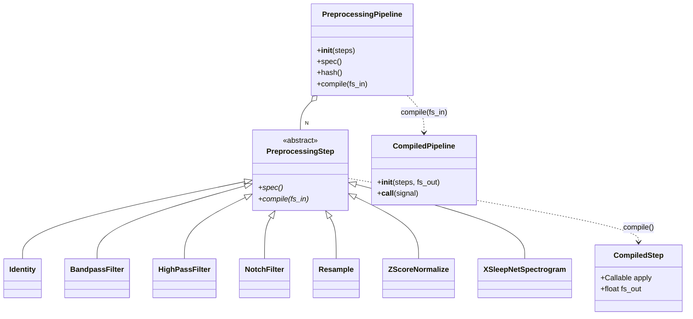
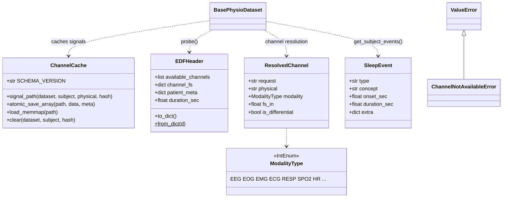

# `physioex.data` — class diagram

The data layer turns raw EDF recordings into model-ready tensors through a
lazy, content-addressed pipeline. Source: `physioex/data/`.

## Dataset hierarchy

The 12 concrete datasets are resolved by name from a **string registry** in
`physioex/data/datasets/__init__.py` — `get_dataset(name)` / `available_datasets()`;
keys: `hmc, sleepedf, dcsm, mesa, mros, hpap, wsc, mass, alzheimers, parkinsons, shhs, stages`.

### Legacy (deprecated)

`PhysioExDataset`/`DataReader` (`data/dataset.py`, `data/datareader.py`) are the
old preprocessed-array layer; both emit a `DeprecationWarning` on instantiation
and are not re-exported from `data/__init__`.

## Preprocessing pipeline

Named presets (`data/presets.py`) build ready pipelines: `get_preset(name)` /
`available_presets()` — e.g. `raw`, `time_domain`, `time_frequency`,
`seqsleepnet`, per-modality (`eeg`/`eog`/`emg`/`ecg`) and per foundation model.

## Cache, readers, events, support

## Class reference (responsibilities)

- **`BasePhysioDataset` (ABC, `base.py`)** — central `torch.utils.data.Dataset`.
  Concrete datasets implement two hooks: `_list_subjects()` (discover subjects →
  `SubjectSpec`) and `_read_subject_labels(spec)` (hypnogram → AASM int array).
  The base handles: header probing + channel resolution, split logic
  (`split`/`get_splits`, 70/15/15 by seed `42+fold`), excess-wake trimming,
  label sanitization, event loading, memmap caching, and `__getitem__` assembling
  the batch dict (`signals, channel_order, channel_info, labels, subject,
  epoch_indices, recording_length, events`). Module fn `get_data_root()` reads
  `$PHYSIOEX_DATA`.
- **`SubjectSpec`** — lightweight locator (`subject_id`, `edf_path`, `label_path`,
  `external_meta`); returned by `_list_subjects`.
- **Concrete datasets** — each sets `DATASET_NAME`, `DATASET_SUBDIR`,
  `CHANNEL_PREFERENCES`, `DEFAULT_EPOCH_LENGTH_SEC`, and constructor extras where
  relevant: `MASSDataset(cohort)`, `SHHSDataset(visit)`, `WSCDataset(visit)`,
  `STAGESDataset(site, recording)`, `AlzheimersDataset(subset)`,
  `ParkinsonsDataset(recording, group)`, `HPAPDataset(subset)`. The four NSRR
  datasets subclass `_NSRRBaseDataset` (shared XML annotation handling).
- **`MultiDataset` (`multi.py`)** — concatenates N `BasePhysioDataset` into one
  flat index with coordinated `split(fold)` (returns `(dataset_idx, subject_id)`
  tuples for valid/test), proportional cache distribution, unified `__getitem__`.
- **`PreprocessingStep` (ABC) / `PreprocessingPipeline` / `Compiled*`
  (`pipeline.py`, `steps/`)** — each step exposes a canonical `spec()` (hashable)
  and `compile(fs_in) -> CompiledStep`. The pipeline hashes to a `pipeline_hash`
  used as the cache key. Steps: `Identity, BandpassFilter, HighPassFilter,
  NotchFilter, Resample, ZScoreNormalize, XSleepNetSpectrogram`.
- **`ChannelCache` (`cache.py`)** — on-disk memmap cache keyed by
  `(SCHEMA_VERSION, dataset, subject, physical_channel, pipeline_hash)` with atomic
  writes; bf16 support via `ml_dtypes` (`recommended_dtype`, `cast_to_cache_dtype`).
- **Readers (`readers/edf.py`, `readers/annotations.py`)** — `probe_edf_header`,
  `resolve_channels` (+ `EDFHeader`, `ResolvedChannel`, `ChannelNotAvailableError`,
  `DEFAULT_PREFERENCES`), and annotation parsers `parse_nsrr_xml`,
  `parse_tsv_annotations`, `parse_nsrr_xml_events`, `parse_stages_csv`.
- **Events (`events.py`)** — `SleepEvent` dataclass + `map_events_to_epochs`,
  `events_to_dicts`/`dicts_to_events` (round-trippable, cached as JSON).
- **Collate (`collate.py`)** — `dict_collate_fn` (deterministic channel-order by
  sorted union — no per-item validation), `stack_channels`, `is_dict_batch`.
- **Modality (`modality.py`)** — `ModalityType` IntEnum + `infer_channel_modality`.