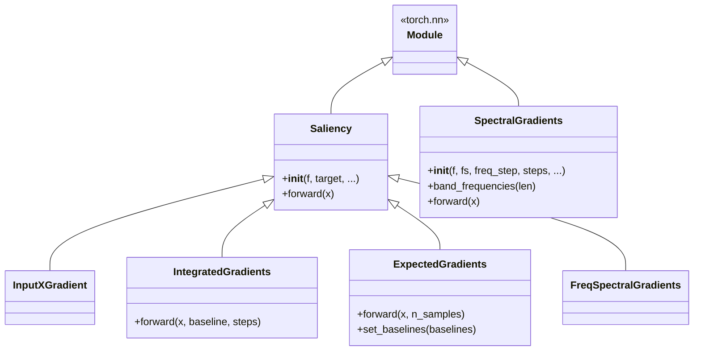
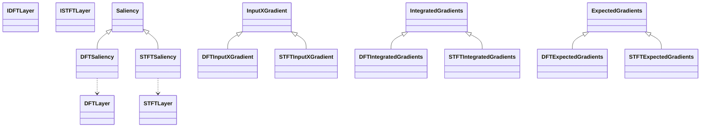
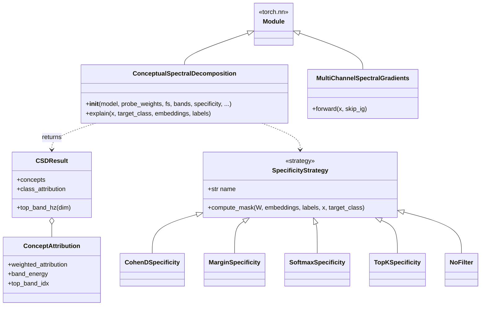
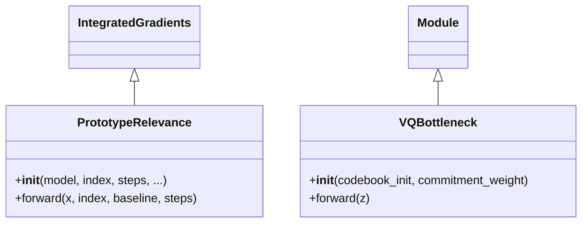

# `physioex.explain` — class diagram

The explainability toolkit: **post-hoc attribution** (time / frequency / time-
frequency), **foundational** concept analysis (CSD), and **prototype** discovery.
Source: `physioex/explain/`.

## Post-hoc attribution

Frequency- and time-frequency-domain variants wrap the same four gradient
methods around differentiable DFT/STFT layers:

Support: `functionizer.py` (`Funct`, `SeqFunct` — wrap a classifier into a scalar
target function), `filters.py` (`filtfilt`, `lowpass_filter`, `highpass_filter`),
`metrics/` (`complexity`, `localization`, `infidelity`, `tfle`, `tf_concentration`,
`resolution_product`).

## Foundational (Conceptual Spectral Decomposition)

Support: `sleep_bands.py` (`FrequencyBand`, `bands_to_bin_ranges`,
`band_center_frequencies`, `band_names`), `report.py` (`spectral_class_profile`,
`concept_atlas`).

## Prototypes

Module-level: `local.py` (`proj_fn`, `get_prototypes`), `reconstruct.py`
(`data_driven_reconstruction`, `model_driven_reconstructions`), `posthoc/nmf.py`
(`discover_prototypes_nmf`), `posthoc/vq.py` (`learn_codebook_kmeans`,
`quantize_embeddings`, `train_codebook`), `posthoc/utils.py`
(`load_epoch_embeddings*`, `nearest_prototype_classify`, `evaluate_metrics`).

## Class reference (responsibilities)

- **`Saliency` family** — Captum-style attributors over a scalar target function `f` (built with `Funct`/`SeqFunct`); `IntegratedGradients`/`ExpectedGradients` add baselines/paths.
- **DFT/STFT variants** — attribute relevance in frequency / time-frequency space via differentiable (I)DFT/(I)STFT layers, subclassing the corresponding time-domain method.
- **`SpectralGradients`** — path-integral attribution across frequency bands.
- **`ConceptualSpectralDecomposition`** — decomposes foundation-model embeddings into interpretable spectral concepts; a pluggable `SpecificityStrategy` selects the concepts most specific to a class; returns a `CSDResult` (list of `ConceptAttribution`).
- **`PrototypeRelevance` / `VQBottleneck`** — prototype relevance (IG-based) and vector-quantized codebook prototypes for concept-level explanation.