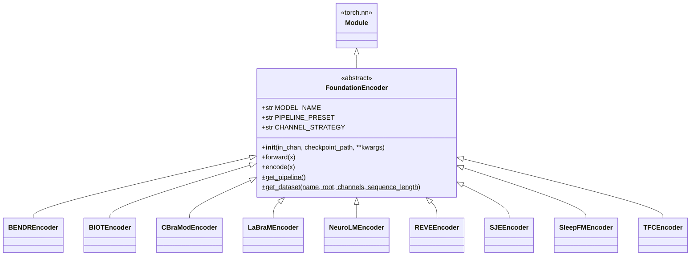
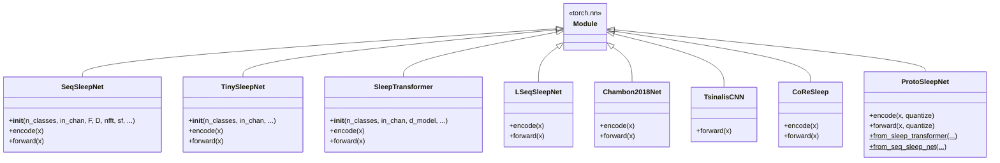
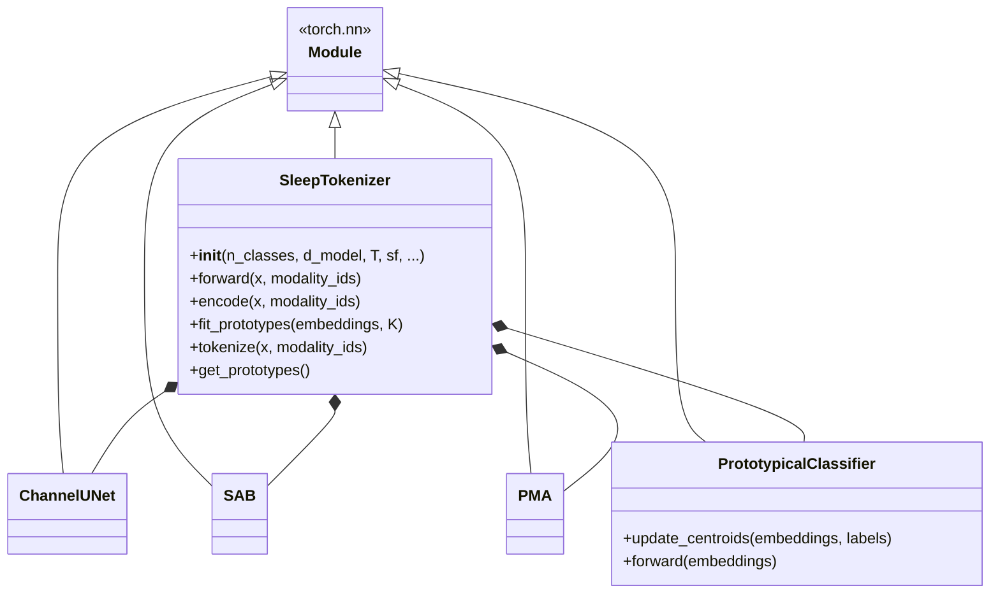

# `physioex.models` — class diagram

Two model families — **foundation encoders** (pretrained backbones adapted to a
uniform interface) and **classic sleep-staging architectures** — plus embedding
extraction, pretrained loading and the VQ sleep tokenizer. Source: `physioex/models/`.

## Foundation encoders

Every encoder declares `MODEL_NAME`, `PIPELINE_PRESET` (the matching preprocessing
preset) and `CHANNEL_STRATEGY`, and adapts a heterogeneous backbone to
`encode: (B,L,C,T) -> (B,L,D)`. Support modules:

- `foundation_base.py` — the ABC + `get_pipeline()`/`get_dataset()` template.
- `foundation_datasets.py` — `DatasetConfig` + `get_dataset_config`/`available_dataset_configs` (PHYSIOEX_DATA-relative roots, channel maps).
- `foundation_checkpoints.py` — `CheckpointSource` + `ensure_checkpoint`, `ensure_reve_positions`, `get_checkpoint_dir`, cache helpers.
- `foundation_channel_mapping.py` — `pad_or_repeat_channels`, `map_to_bendr_layout`.
- `foundation_preproc.py` — ~18 differentiable normalization/channel ops (`mean_center`, `zscore*`, `q95_normalize`, `strip_zero_channels`, `compute_channel_stats`, ...).

## Classic architectures

Common contract: `__init__(n_classes, in_chan, ...)`, `forward(x)` and (most)
`encode(x)`. `ProtoSleepNet` adds prototype quantization and factory
constructors from `SleepTransformer`/`SeqSleepNet` epoch encoders; its training
uses `ProtoSleepNetTrainer(Trainer)`.

## Sleep tokenizer & helpers

## Embedding & pretrained API (module-level)

- `embed.py` — `extract_embeddings(model, dataset, ...)`, `load_embeddings(model_name, dataset_name, ...)`, `linear_probe(model_name, dataset_name, n_folds, ...)` (HF-backed embedding cache).
- `pretrained.py` — `load_from_pretrained(name, device, repo_id)` reconstructs any model from a HF `config.json` (`model_class` + `model_kwargs`) in `4rooms/physioex`.
- `models/__init__.py` re-exports `load_from_pretrained`, the embed helpers, `FoundationEncoder` and the 9 encoders. Classic architectures are imported from their own modules.

## Class reference (responsibilities)

- **`FoundationEncoder` (ABC)** — uniform adapter over pretrained backbones; subclasses only build/load the backbone and rely on the base for `forward`, `get_pipeline`, `get_dataset` (which resolves a `DatasetConfig` and builds the matching `BasePhysioDataset`). The `transformers` import in `REVEEncoder` is lazy (`physioex[foundation]`).
- **Classic architectures** — self-contained `nn.Module`s for sleep staging; `encode` returns per-epoch features, `forward` returns `(B, L, n_classes)` logits.
- **`SleepTokenizer`** — VQ tokenizer: `ChannelUNet` feature extractor + set-transformer blocks (`SAB`/`PMA`) + `PrototypicalClassifier`; `fit_prototypes`/`tokenize` produce discrete codes. Helpers `infer_modality`, `build_modality_ids`, `modality_dropout`.
- **Support modules** — checkpoint/dataset/channel/preproc utilities that keep encoders declarative.
