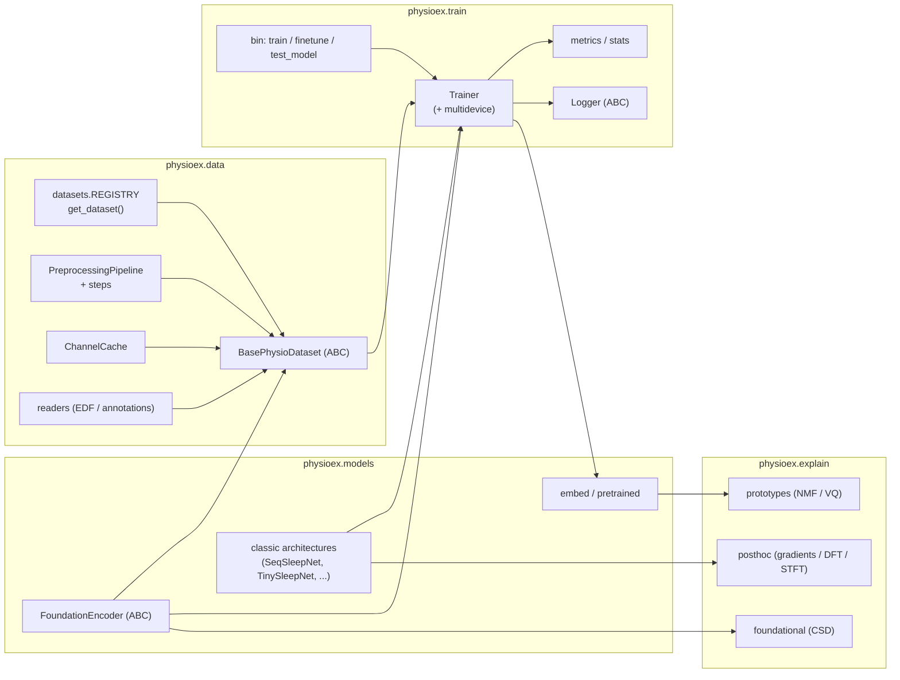
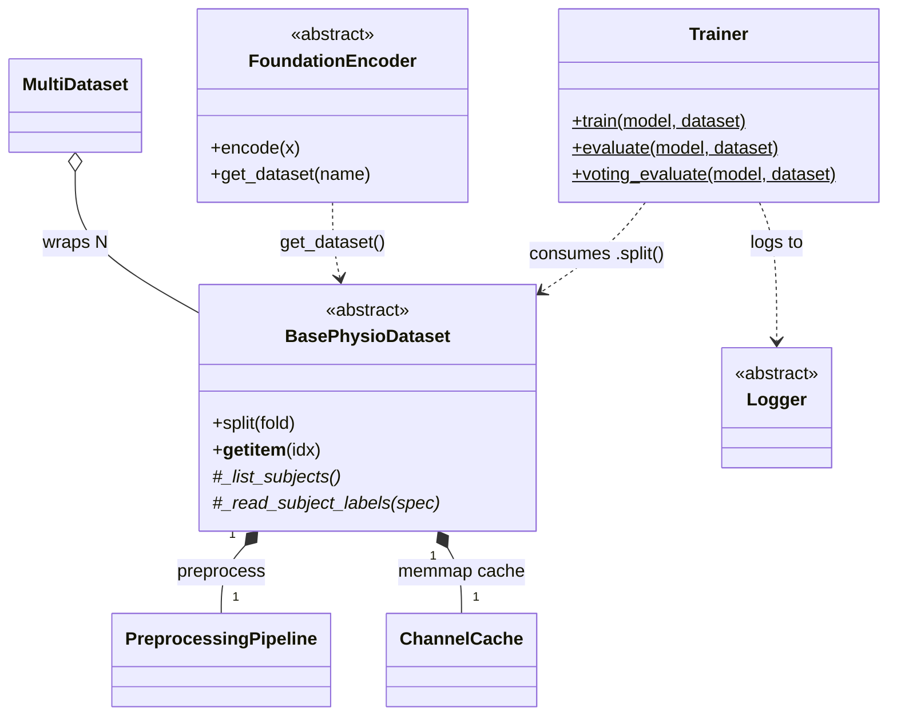

# Library architecture — overview

This section is the **living class-diagram documentation** of the PhysioEx
library (Diagram A). It is extracted directly from the source and is kept in
sync with the code: every class, its public methods and its relationships
mirror `physioex/`. Each subpackage has its own page:

- [Data](data.md) — datasets, preprocessing pipeline, cache, readers, events.
- [Models](models.md) — foundation encoders, classic architectures, embeddings, pretrained loading.
- [Train](train.md) — training/evaluation loop, metrics, stats, logging, CLIs.
- [Explain](explain.md) — post-hoc attribution, foundational (CSD), prototypes.

## Subsystem map

## Principal types and cross-cutting relationships

## Design patterns used

- **Abstract base classes**: `BasePhysioDataset`, `PreprocessingStep`, `FoundationEncoder`, `Logger`, `SpecificityStrategy` define the extension points.
- **String registry**: `physioex/data/datasets/__init__.py` maps names → dataset classes (`get_dataset`, `available_datasets`); `foundation_checkpoints`/`foundation_datasets` do the same for models.
- **Dynamic factory** `"module.path:ClassName"`: resolved by `physioex/train/bin/_common.py:import_class` and `physioex/train/models/load.py`.
- **Strategy**: `SpecificityStrategy` subclasses in `explain/foundational/specificity.py`; the `CHANNEL_STRATEGY` class attribute on encoders.
- **Template method / adapter**: `FoundationEncoder` wraps heterogeneous pretrained backbones behind a uniform `(B,L,C,T) -> (B,L,D)` `encode`.
- **Content-addressed caching**: `PreprocessingPipeline.hash()` keys the on-disk `ChannelCache`.

## Main flows

- **Data → tensor**: `get_dataset(name)(channels, pipelines, sequence_length)` → `_list_subjects` + header probe + channel resolution → `__getitem__` reads channels, applies the compiled `PreprocessingPipeline` (cached in `ChannelCache`), returns a dict `{signals, labels, channel_order, subject, events, ...}` collated by `dict_collate_fn`.
- **Training**: `Trainer.train(model, dataset)` → `build_dataloaders` (uses `dataset.split(fold)`) → hand-written epoch loop → `evaluate`/`voting_evaluate` → metrics/stats, logged via a `Logger` backend. The three CLIs (`train`/`finetune`/`test_model`) share this path through `bin/_common.py`.
- **Foundation embeddings**: `FoundationEncoder.get_dataset(name)` builds the matching preprocessing → `encode` → `extract_embeddings`/`linear_probe`.
- **Explainability**: post-hoc gradient/DFT/STFT attributions over a trained classifier; `ConceptualSpectralDecomposition` over foundation embeddings; prototype discovery (NMF/VQ) over cached embeddings.