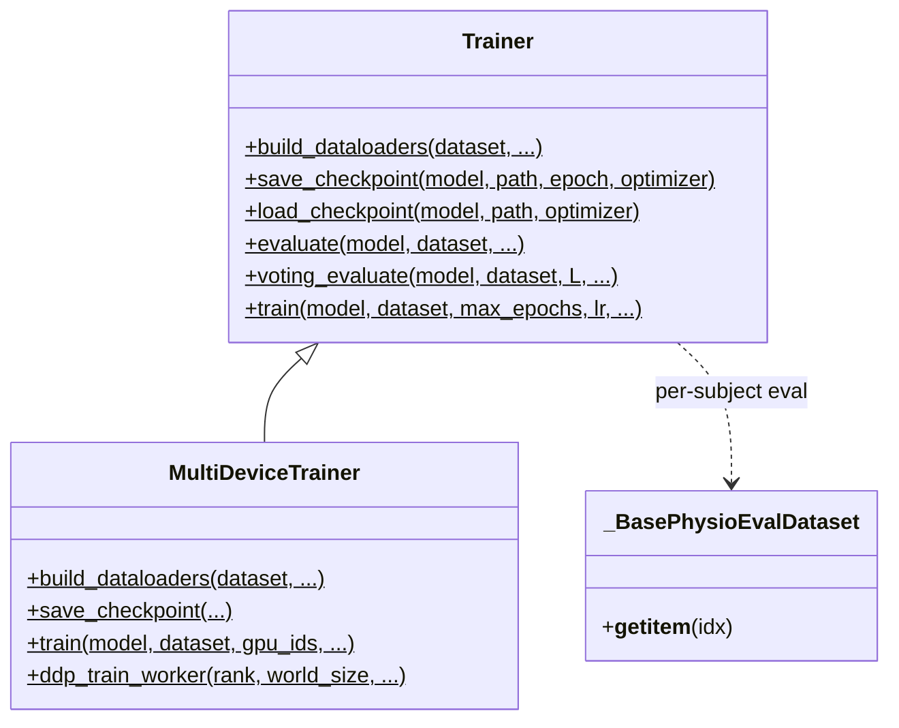
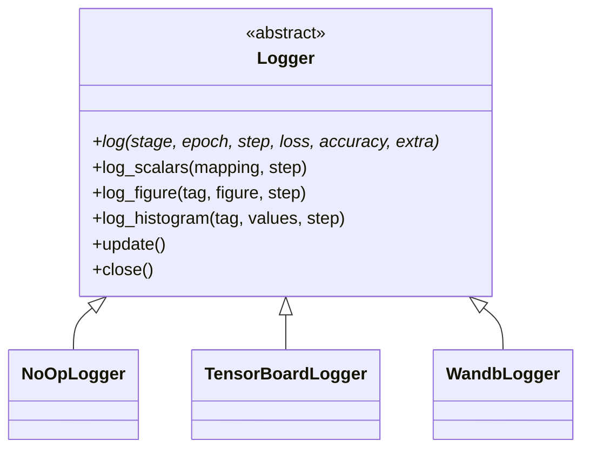
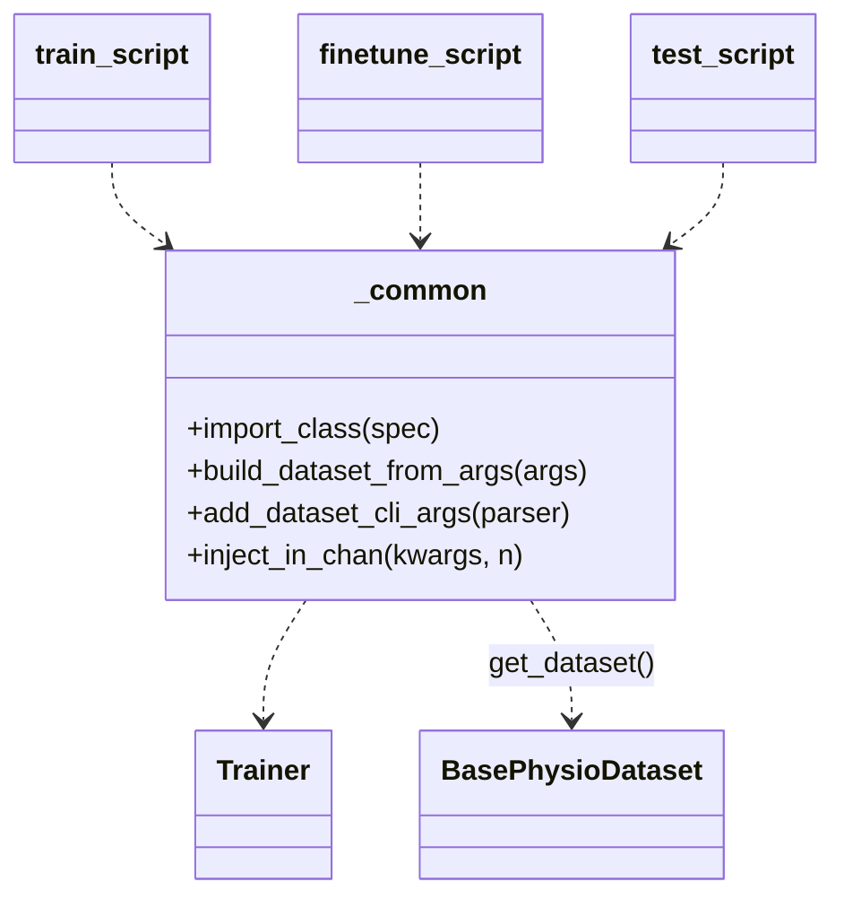

# `physioex.train` — class diagram

A **hand-written PyTorch training/evaluation loop** (not Lightning), with metric
and statistics helpers, pluggable logging, and three CLI entry points that share
one data path. Source: `physioex/train/`.

## Trainer

`Trainer` (`trainer.py`) exposes only static/classmethods: `build_dataloaders`
(detects new `BasePhysioDataset`/`MultiDataset` vs legacy, wires `dict_collate_fn`
+ per-subject `_BasePhysioEvalDataset`), `train` (epoch loop, AMP, grad accum,
early stopping), `evaluate` and `voting_evaluate` (sliding-window per-subject
voting), `save_checkpoint`/`load_checkpoint` (dual `.pt`/`.ckpt` load). Module fn
`seed_everything(seed)`. `MultiDeviceTrainer` (`multidevicetrainer.py`) subclasses
it for DDP (`ddp_setup`, `ddp_train_worker`), now on the same raw-EDF data path.

## Logging

`build_logger(kind, ...)` factory + `add_logger_cli_args`/`logger_train_kwargs`
bridge argparse → logger. TensorBoard/W&B live behind the `tracking` extra.

## Metrics, stats, progress, CLIs (module-level)

- **`metrics.py`** — classification (`accuracy_score`, `f1_score`, `precision_score`, `recall_score`, `cohen_kappa_score`, `support_score`, `confusion_matrix`) and regression (`mse_score`, `mae_score`, `r2_score`) with `ignore_index`/`average`.
- **`stats.py`** — `per_subject_metrics`, `aggregate` (mean/std/CI, bootstrap or normal), `aggregated_scalars`, `confusion_matrix_figure`, `figure_from_cm`.
- **`progress.py`** — `PhysioExTrainProgressBar`, `PhysioExEvalProgressBar` (Rich).
- **`bin/`** — `train_script`, `finetune_script`, `test_script` (console scripts `train`/`finetune`/`test_model`), all built on the shared **`bin/_common.py`** helpers: `import_class`, `parse_kwargs`, `add_dataset_cli_args`, `apply_config_overlay`, `build_dataset_from_args`, `inject_in_chan`.
- **`models/load.py`** — `load_model(model_class, model_kwargs, ckpt_path, model_name, device)` (CSV registry `check_table.csv` + HF auto-download).

## Class reference (responsibilities)

- **`Trainer`** — orchestrates training/eval without owning state (pure static/class methods). Accepts any dataset exposing `.split(fold)` and `.sequence_length` (new layer, `MultiDataset`, or legacy) plus raw `DataLoader`s.
- **`MultiDeviceTrainer`** — DDP variant; `build_dataloaders` mirrors the single-device detection and adds `DistributedSampler`.
- **`_BasePhysioEvalDataset`** — internal wrapper yielding the full recording per subject for voting evaluation.
- **`Logger` hierarchy** — uniform logging surface; `NoOpLogger` is the default (no external deps).
