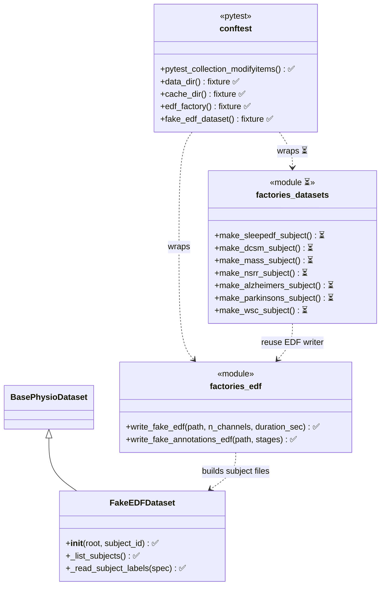
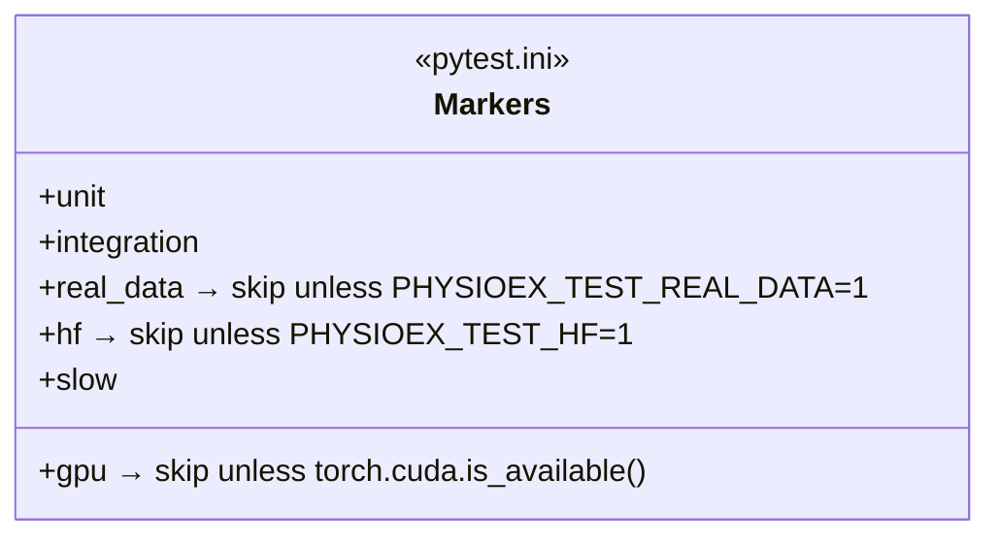
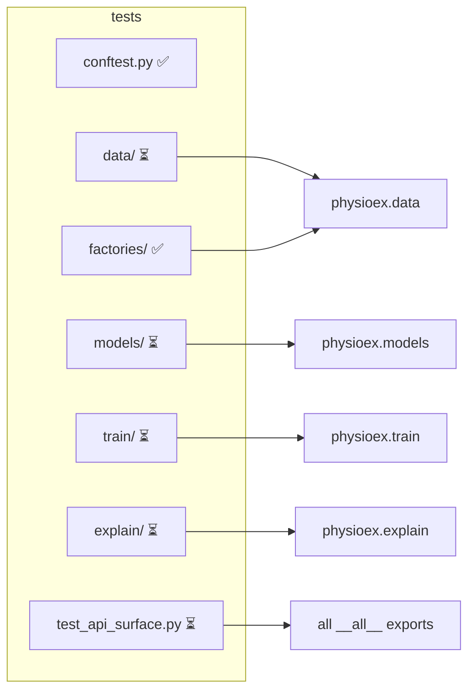

# Testing suite architecture (Diagram B)

Living class/structure diagram of the **pytest** test suite. Kept in sync with
`tests/` at every phase and checked for congruence against the
[library diagram](../library/overview.md) (Diagram A). Legend: ✅ in place
(Fase A) · ⏳ planned (Fase B/C).

## Scaffolding: fixtures & factories

## Markers (gating)

## Target module layout ↔ library mapping

Each test module targets exactly the public symbols documented in Diagram A
(congruence rule). ✅ = scaffolding present, ⏳ = to be migrated/added.

## Conventions

- **pytest-only**: plain `assert`, fixtures, `@pytest.mark.parametrize`; no
  `report()/passed/failed/__main__` scaffolding (removed in Fase B).
- **Single source of truth for synthetic data**: `tests/factories/` (the old
  `tests/test_raw_dataset_integration` re-exports become imports in Fase B).
- **Coverage**: measured over `physioex` (legacy modules omitted), gate enforced
  in CI (Fase D).
