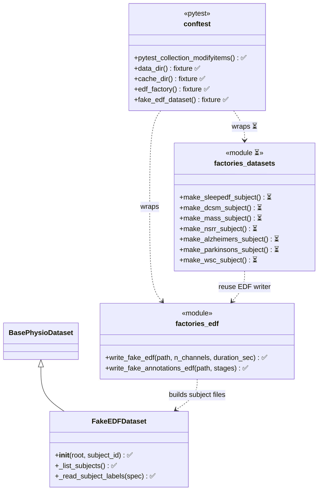
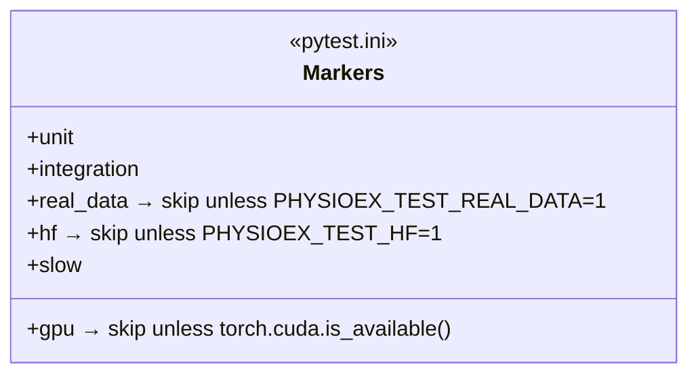
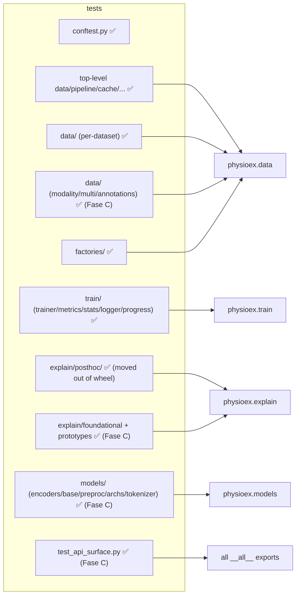

# Testing suite architecture (Diagram B)

Living class/structure diagram of the **pytest** test suite. Kept in sync with
`tests/` at every phase and checked for congruence against the
[library diagram](../library/overview.md) (Diagram A). Legend: ✅ in place
(Fase A) · ⏳ planned (Fase B/C).

## Scaffolding: fixtures & factories

## Markers (gating)

## Test module layout ↔ library mapping

Each test module targets the public symbols documented in Diagram A (congruence
rule). ✅ = migrated to pytest (Fase B) · ⏳ = capillary gaps to add (Fase C).

## Conventions

- **pytest gating**: tests fail via `assert` (native, or a 2-line `report()`
  assert shim in the large dataset files); the `passed/failed/__main__/sys.exit`
  script scaffold is removed. `test_cli_workflows` remains `unittest`-style
  (pytest-collected).
- **Single source of truth for synthetic data**: `tests/factories/edf.py`
  (all former `tests.test_raw_dataset_integration` importers migrated).
- **Unified tree**: the former in-package `physioex/explain/posthoc/tests/`
  now lives under `tests/explain/posthoc/` and no longer ships in the wheel.
- **Markers**: `real_data` / `gpu` / `hf` auto-skip unless their environment is
  present (see `conftest.py`).
- **Coverage**: measured over `physioex` (legacy modules omitted), gate enforced
  in CI (Fase D).

## Status (Fase C complete)

Full suite on A30 (`-m "not real_data and not gpu and not hf"`):
**701 passed, 4 skipped, 14 deselected** (up from 490 after Fase B — +211
capillary tests). Line coverage over `physioex` ≈ **52%** (HF-gated encoder
internals, DDP `multidevicetrainer`, checkpoint downloaders and CLI bins are
legitimately un-exercised in CI; the Fase D gate accounts for this).

**Fase C** added, by subpackage:

- `tests/data/` — `test_modality.py` (`infer_channel_modality` across all
  `ModalityType` buckets + hint precedence), `test_multi.py` (`MultiDataset`
  indexing/split/accessors), `test_readers_annotations.py` (`parse_nsrr_xml`,
  `parse_tsv_annotations`, `parse_nsrr_xml_events`, `parse_stages_csv`).
- `tests/train/` — `test_stats.py` (per-subject aggregation + CM figures),
  `test_logger.py` (`Logger`/`NoOpLogger`/`build_logger` + CLI helpers),
  `test_progress.py` (progress-bar state, non-TTY path).
- `tests/models/` — `test_foundation_base.py` (wrapper contract via a fake
  subclass), `test_foundation_preproc.py` (all pure-torch ops),
  `test_foundation_encoders.py` (9 encoders: cheap contract + `@hf` build),
  `test_architectures.py` (Chambon/Tsinalis/SleepTransformer/LSeqSleepNet
  forward shapes), `test_sleep_tokenizer.py`, `test_pretrained_embed_helpers.py`.
- `tests/explain/` — `foundational/test_specificity.py`,
  `foundational/test_sleep_bands.py`, `prototypes/posthoc/test_nmf_vq.py`.
- `tests/test_api_surface.py` — every `__all__` export importable + console
  scripts resolve.

Heavy paths are gated: foundation-encoder builds are `@hf`/`@slow`;
GPU-specific paths `@gpu`; real-data smoke `@real_data`. All deselected by
default and run on bio-gpu via `dispatch`.