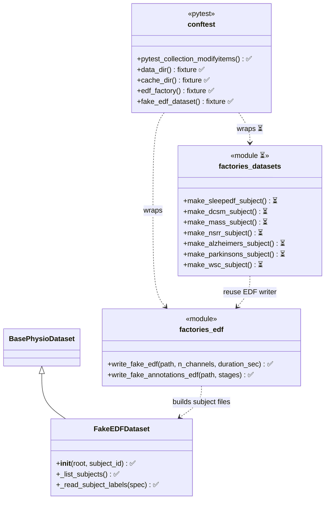
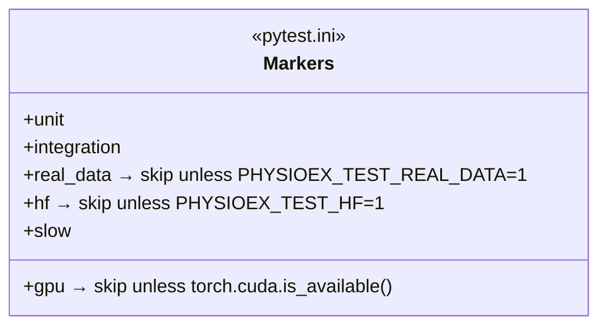
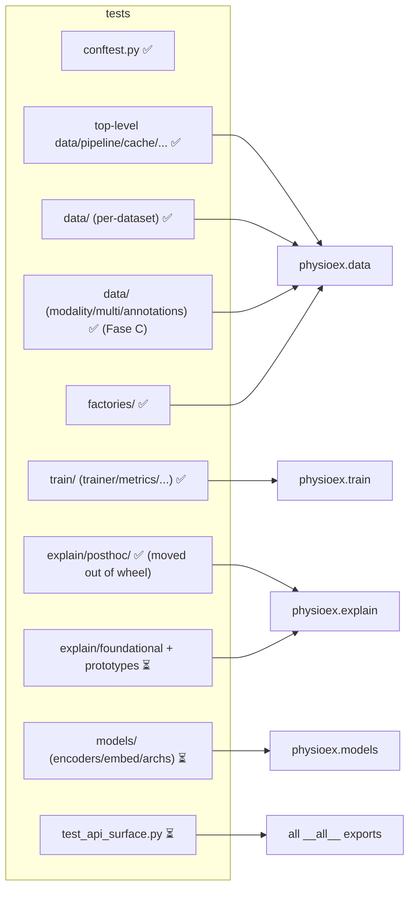

# Testing suite architecture (Diagram B)

Living class/structure diagram of the **pytest** test suite. Kept in sync with
`tests/` at every phase and checked for congruence against the
[library diagram](../library/overview.md) (Diagram A). Legend: ✅ in place
(Fase A) · ⏳ planned (Fase B/C).

## Scaffolding: fixtures & factories

## Markers (gating)

## Test module layout ↔ library mapping

Each test module targets the public symbols documented in Diagram A (congruence
rule). ✅ = migrated to pytest (Fase B) · ⏳ = capillary gaps to add (Fase C).

## Conventions

- **pytest gating**: tests fail via `assert` (native, or a 2-line `report()`
  assert shim in the large dataset files); the `passed/failed/__main__/sys.exit`
  script scaffold is removed. `test_cli_workflows` remains `unittest`-style
  (pytest-collected).
- **Single source of truth for synthetic data**: `tests/factories/edf.py`
  (all former `tests.test_raw_dataset_integration` importers migrated).
- **Unified tree**: the former in-package `physioex/explain/posthoc/tests/`
  now lives under `tests/explain/posthoc/` and no longer ships in the wheel.
- **Markers**: `real_data` / `gpu` / `hf` auto-skip unless their environment is
  present (see `conftest.py`).
- **Coverage**: measured over `physioex` (legacy modules omitted), gate enforced
  in CI (Fase D).

## Status (Fase B complete · Fase C in progress)

Full suite on A30 (`-m "not real_data and not gpu and not hf"`) after Fase B:
**490 passed, 4 skipped, 5 deselected**. All 6 previously-stale tests fixed.

**Fase C** (capillary coverage of Diagram-A gaps) adds, incrementally:

- `tests/data/test_modality.py` — `infer_channel_modality` across all
  `ModalityType` buckets, hint precedence, enum/`MODALITY_TYPES` invariants.
- `tests/data/test_multi.py` — `MultiDataset` flat indexing, negative/OOR
  guards, `dataset_idx` injection, `split()` coordination, accessors,
  sequence-length invariant.
- `tests/data/test_readers_annotations.py` — `parse_nsrr_xml`,
  `parse_tsv_annotations`, `parse_nsrr_xml_events`, `parse_stages_csv`
  (dur0/dur30/blocks variants) on synthetic inputs.

Remaining Fase C targets (⏳): `models/` (foundation encoders as contracts,
embed/pretrained mocked, classic archs, sleep_tokenizer), `train/{stats,logger,
progress}`, `explain/{foundational,prototypes}`, `test_api_surface.py`.
